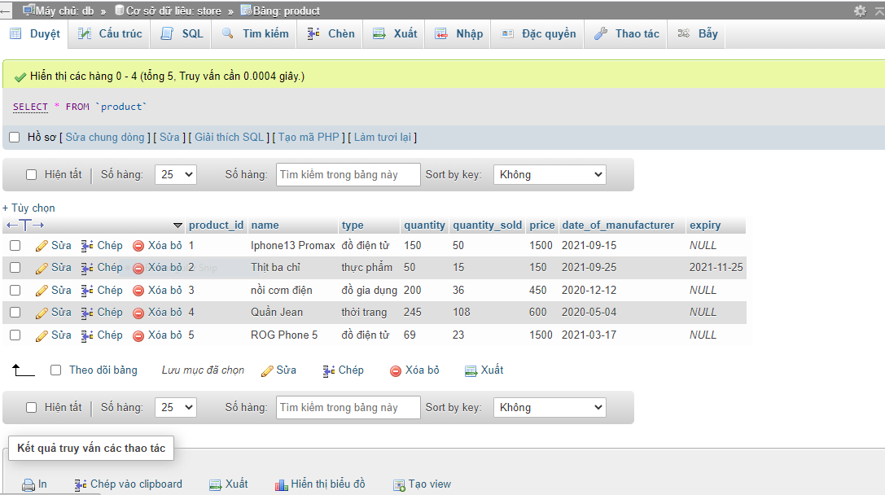

## Tạo Database

```sql
CREATE DATABASE store;
```

## Tạo bảng
```sql
    CREATE TABLE product(
        product_id int PRIMARY KEY,
        name TEXT NOT NULL,
        type VARCHAR(50),
        quantity int,
        quantity_sold int,
        price int,
        date_of_manufacturer DATE,
        expiry DATE
    );
```

## Thêm dữ liệu
```sql
    INSERT INTO product(product_id, name, type, quantity, quantity_sold, price, date_of_manufaceturer, expiry)
    VALUES(1, 'Iphone 13 Promax', 'thiết bị điện tử', 150, 50 ,1500, '2021-9-15', NULL),
          (2, 'Thịt ba chỉ', 'thực phẩm', 50, 15, 150, '2021-9-25', NULL),
          (3, 'nồi cơm điện', 'đồ gia dụng', 200, 36, 450, '2020-12-12', NULL),
          (4, 'Quần Jean', 'thời trang', 245, 108, 600, '2020-5-4', NULL),
          (5, 'ROG Phone 5', 'thiết bị điện tử', 69, 23, 1500, '2021-3-7', NULL);
```

