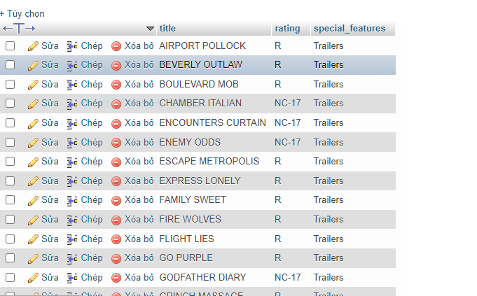
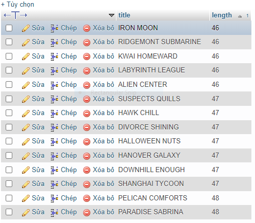
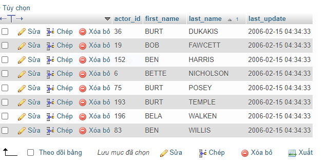
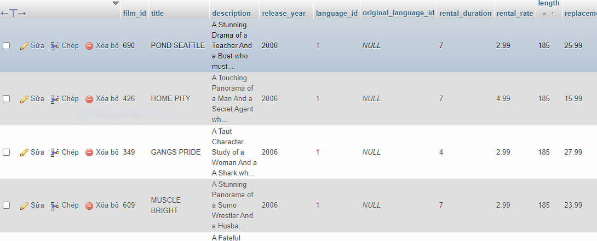

## 1, Lấy tên phim, rating, special_features các bộ phim có rating là NC-17 hoặc R, có special_features là Trailers

```sql
    SELECT title, rating, special_features
    FROM `film` 
    WHERE rating IN('NC-17', 'R') AND special_features = 'trailers'

```


## 2, Lấy ra tên phim, length các bộ phim có length nhỏ hơn 70 hoặc length lớn hơn 100. Sắp xếp phim theo thứ tự length tăng dần

```sql
    SELECT title, length
    FROM `film` 
    WHERE length < 70 OR length > 100
    ORDER BY length ASC
```

## 3, Lấy ra các actor có first_name bắt đầu là chữ B và sắp xếp theo thứ tự last_name tăng dần

```sql
    SELECT * 
    FROM `actor` 
    WHERE first_name LIKE 'B%'
    ORDER BY last_name ASC
```

## 4, Lấy ra các bộ phim không có chứa từ 'LIFE', không phải rating PG và sắp xếp theo thứ tự length giảm dần

```sql
    SELECT * 
    FROM `film` 
    WHERE title NOT LIKE '%LIFE%' AND rating != 'PG'
    ORDER BY length DESC

```
